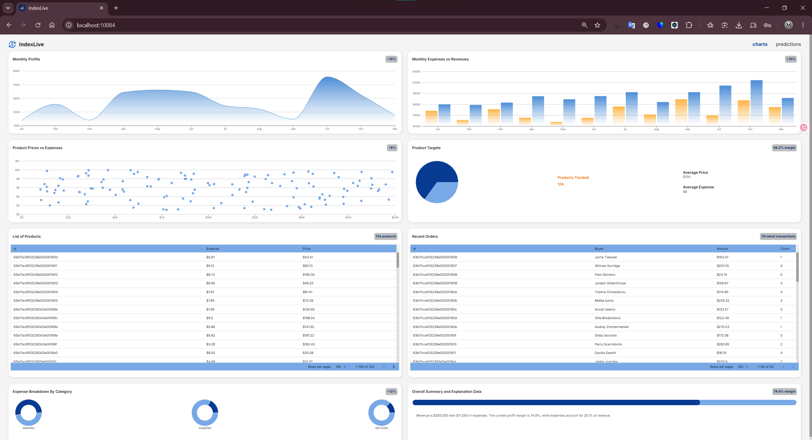
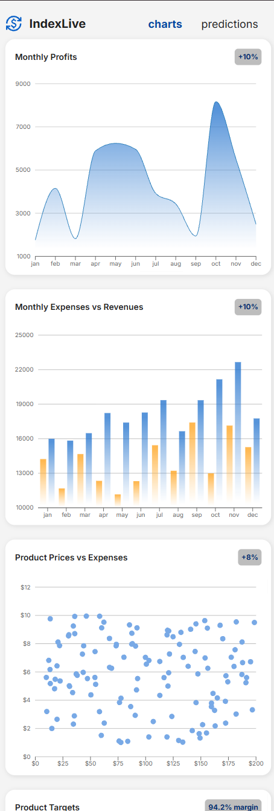
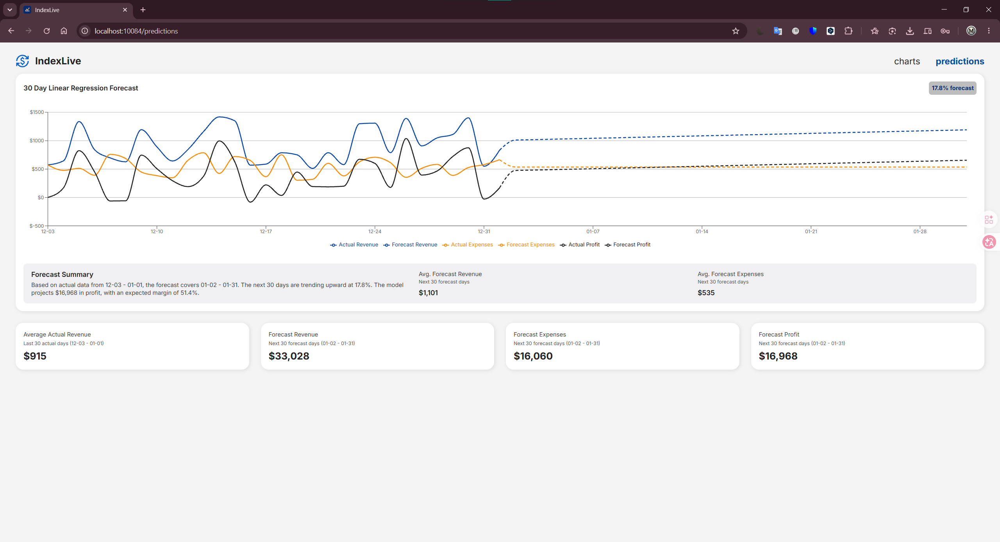
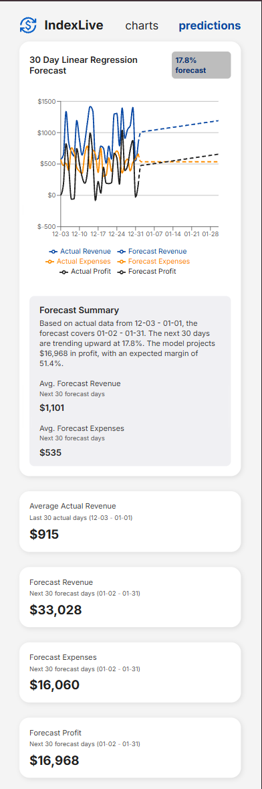
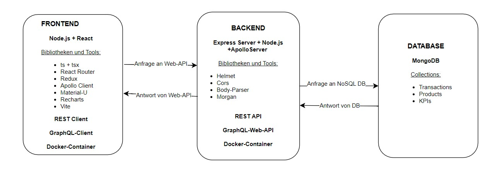
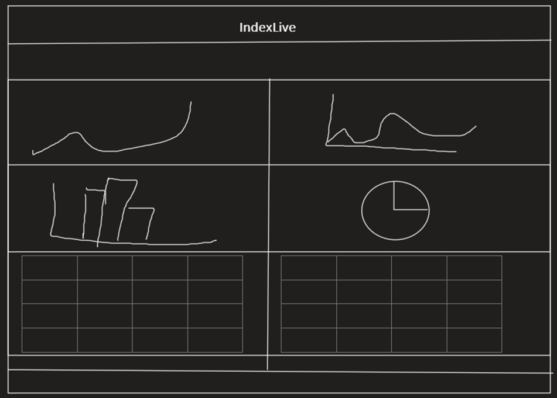

# IndexLive – Full-Stack Finanz-Dashboard


IndexLive ist eine Full-Stack-Webanwendung zur Visualisierung und Verwaltung von Finanzdaten.  
Die Anwendung stellt betriebswirtschaftliche Kennzahlen, Produkte und Transaktionen in einem interaktiven Dashboard dar und bietet dafür REST- sowie GraphQL-Schnittstellen.

Das Projekt zeigt den Aufbau einer modernen MERN-Anwendung mit React, TypeScript, Express, MongoDB, Redux Toolkit, Apollo Client und Docker.

---

## Inhaltsverzeichnis

- [Projektüberblick](#projektüberblick)
- [Screenshots](#screenshots)
- [Ziel des Projekts](#ziel-des-projekts)
- [Funktionsumfang](#funktionsumfang)
- [Tech Stack](#tech-stack)
- [Architektur](#architektur)
- [API-Übersicht](#api-übersicht)
- [Datenmodelle](#datenmodelle)
- [Lokale Installation](#lokale-installation)
- [Start mit Docker](#start-mit-docker)
- [Start ohne Docker](#start-ohne-docker)
- [Was ich mit diesem Projekt umgesetzt habe](#was-ich-mit-diesem-projekt-umgesetzt-habe)
- [Lizenz](#Lizenz)

---

## Projektüberblick

IndexLive besteht aus einem React-Frontend, einem Express-Backend und einer MongoDB-Datenbank.

Das Frontend stellt Finanzdaten in Form von Diagrammen, Tabellen und Kennzahlen dar.  
Das Backend stellt die Daten über REST-Endpunkte und eine GraphQL-Schnittstelle bereit.  
Die Daten werden über Mongoose in MongoDB gespeichert und verarbeitet.

---

## Screenshots

### Dashboard



Das Dashboard zeigt die zentrale Uebersicht der Anwendung mit KPIs, Diagrammen, Produktdaten und aktuellen Transaktionen.

---

#### Dashboard - Responsive Ansicht



Diese Ansicht zeigt, wie sich das Dashboard auf kleineren Bildschirmen anordnet und weiterhin nutzbar bleibt.

---

### Predictions



Die Predictions-Ansicht berechnet mit linearer Regression eine 30-Tage-Prognose auf Basis der letzten Tageswerte und zeigt erwartete Umsatz-, Kosten- und Gewinnentwicklungen.

---

#### Predictions - Responsive Ansicht



Die responsive Predictions-Ansicht zeigt die Prognose und Zusammenfassung optimiert fuer mobile Bildschirmbreiten.

---

### Architekturzeichnung



Die Architekturzeichnung erklaert den technischen Aufbau mit Frontend, Backend, REST-/GraphQL-Schnittstellen und MongoDB-Datenbank.

---

### Projektentwurf



Der Projektentwurf zeigt die geplante Struktur und die wichtigsten Bereiche der Anwendung vor der technischen Umsetzung.

---

### REST-API mit Swagger


Die Swagger-Ansicht dokumentiert die REST-Endpunkte und ermoeglicht das direkte Testen der Backend-API im Browser.

---

## Ziel des Projekts

Ziel war die Entwicklung eines webbasierten Finanz-Dashboards, das wirtschaftliche Daten übersichtlich visualisiert und über ein eigenes Backend bereitstellt.

Die Anwendung bildet typische Anforderungen einer datenbasierten Business-Anwendung ab:

- Verwaltung von Produkten
- Verwaltung von Transaktionen
- Darstellung von Umsatz, Kosten und Gewinn
- Visualisierung von Monats- und Tagesdaten
- Bereitstellung strukturierter Backend-Schnittstellen
- Trennung von Frontend, Backend und Datenbank
- Containerisierung der Anwendung mit Docker

---

## Funktionsumfang

- Dashboard-Oberfläche mit React, TypeScript und Material UI
- Darstellung zentraler KPIs
- Anzeige von Produkten und Transaktionen
- Visualisierung von Umsatz-, Kosten- und Gewinnentwicklungen
- Diagramme mit Recharts
- REST-API für Produkte, Transaktionen und KPIs
- GraphQL-API für Transaktionsdaten
- API-Zugriff über Redux Toolkit Query
- GraphQL-Zugriff über Apollo Client
- Backend mit Express, MongoDB und Mongoose
- API-Dokumentation mit Swagger
- Docker-Setup für Frontend, Backend und MongoDB

---

## Tech Stack

### Frontend

- React
- TypeScript
- Vite
- Material UI
- Redux Toolkit Query
- Apollo Client
- Recharts
- React Router

### Backend

- Node.js
- Express
- MongoDB
- Mongoose
- GraphQL
- Apollo Server
- Swagger
- Helmet
- Morgan
- Dotenv

### Infrastruktur

- Docker
- Docker Compose
- MongoDB

---

## Architektur

```txt
indexlive/
├── frontend/              # React-Frontend mit Dashboard, Routing und API-Zugriff
├── backend/               # Express-Backend mit REST- und GraphQL-Schnittstellen
├── database/              # Lokale Datenbankdaten für Docker
├── dokumentation/         # Screenshots, Architektur und Projektdokumentation
└── docker-compose.yml     # Container-Setup für Frontend, Backend und MongoDB
````

Die Anwendung ist in drei Hauptbereiche getrennt:

1. **Frontend**
   Verantwortlich für Benutzeroberfläche, Routing, API-Zugriff und Datenvisualisierung.

2. **Backend**
   Verantwortlich für REST-Endpunkte, GraphQL, Geschäftslogik und Datenbankzugriff.

3. **Datenbank**
   MongoDB speichert Produkte, Transaktionen und KPI-Daten.

---

## API-Übersicht

### REST-Endpunkte

```http
GET    /kpi/kpis
```

```http
GET    /product/products
POST   /product/products
PUT    /product/products/:id
DELETE /product/products/:id
```

```http
GET    /transaction/transactions
POST   /transaction/transactions
PUT    /transaction/transactions/:id
DELETE /transaction/transactions/:id
```

---

### GraphQL

```http
POST /graphql
```

Beispiel-Query:

```graphql
query {
  transactions {
    id
    buyer
    amount
    productIds
  }
}
```

---

### Swagger-Dokumentation

```http
/api-docs
```

Die REST-API ist über Swagger dokumentiert und kann direkt im Browser getestet werden.

---

## Datenmodelle

### Product

```txt
price
expense
transactions
```

### Transaction

```txt
buyer
amount
productIds
```

### KPI

```txt
totalProfit
totalRevenue
totalExpenses
expensesByCategory
monthlyData
dailyData
```

---

## Lokale Installation

### Voraussetzungen

* Node.js
* npm
* Docker
* Docker Compose
* MongoDB oder MongoDB Atlas

---

## Umgebungsvariablen

### Backend

Im Ordner `backend` eine `.env`-Datei erstellen:

```env
MONGO_URL=your_mongodb_connection_string
PORT=10081
DATABASE_PORT=10085
PROJECT_ID=1957
SEED_DB=false
RESET_DB=false
```

`SEED_DB=true` laedt die Demo-Daten, wenn die Datenbank noch leer ist.
`RESET_DB=true` leert die Datenbank vorher und sollte nur bewusst lokal genutzt werden.

### Frontend

Im Ordner `frontend` eine `.env`-Datei erstellen:

```env
VITE_BASE_URL=http://localhost:10081
```

Wichtig: Zugangsdaten wie MongoDB-Verbindungszeichenfolgen sollten nicht direkt im Repository gespeichert werden.

---

## Start mit Docker

Repository klonen:

```bash
git clone https://github.com/mohammadtaiba/indexlive.git
cd indexlive
```

Container starten:

```bash
docker compose up --build
```

Danach sind die Dienste erreichbar unter:

```txt
Frontend:   http://localhost:10084
Backend:    http://localhost:10081
GraphQL:    http://localhost:10081/graphql
Swagger:    http://localhost:10081/api-docs
```

Container stoppen:

```bash
docker compose down
```

---

## Start ohne Docker

### Backend starten

```bash
cd backend
npm install
npm run dev
```

### Frontend starten

```bash
cd frontend
npm install
npm run dev
```

---

## Beispielablauf der Anwendung

1. Das Frontend lädt Dashboard-Daten über die Backend-API.
2. Das Backend verarbeitet die Anfrage über Express-Routen.
3. Mongoose ruft die Daten aus MongoDB ab.
4. Die Daten werden als JSON oder über GraphQL zurückgegeben.
5. Das Frontend visualisiert die Daten in Tabellen, Karten und Diagrammen.

---

## Was ich mit diesem Projekt umgesetzt habe

* Aufbau einer Full-Stack-Anwendung mit getrenntem Frontend und Backend
* Entwicklung eigener REST-Endpunkte mit Express
* Integration einer GraphQL-Schnittstelle mit Apollo Server
* Anbindung einer MongoDB-Datenbank über Mongoose
* State-Management und API-Zugriff mit Redux Toolkit Query
* GraphQL-Abfragen im Frontend mit Apollo Client
* Umsetzung eines responsiven Dashboards mit Material UI
* Visualisierung von Finanzdaten mit Recharts
* API-Dokumentation mit Swagger
* Containerisierung mit Docker und Docker Compose
* Strukturierung eines Projekts nach Frontend-, Backend- und Datenbank-Verantwortlichkeiten

---

## Technischer Fokus

Dieses Projekt ist besonders relevant für folgende Themenbereiche:

* Full-Stack-Webentwicklung
* REST-API-Entwicklung
* GraphQL-Integration
* Datenvisualisierung
* MongoDB-Datenmodellierung
* React-Komponentenstruktur
* TypeScript im Frontend
* Docker-basierte Entwicklungsumgebung
* API-Dokumentation
* Trennung von Verantwortlichkeiten zwischen Client und Server

---

## Lizenz

Dieses Projekt dient Demonstrationszwecken.
Eine Weiterverwendung ist nur nach Absprache erlaubt.

Autor: Mohammad Taiba
